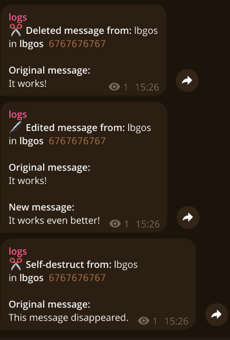

# TGLOG

A small Telegram logger I made for my own account. It keeps a local cache of messages and forwards deleted or edited ones into a private log channel. Media can be cached too, so a deleted photo or video is still there when Telegram removes it.

This is mostly a practical tool I wanted to have running in the background: simple Python, SQLite, and one Docker Compose command. It is not a polished Telegram product and it does not try to be one.

Use it only with accounts, chats, and data you are allowed to monitor. The cache contains private message content, so treat the `data/` directory like a password manager backup.

## Example
### works for pictures and videos too!


## What it does

- Watches incoming and outgoing messages from the connected Telegram account
- Sends deleted and edited messages to a chosen private log channel
- Downloads photos, videos, and documents before they disappear, with size limits
- Tries to save self-destructing media as soon as it arrives
- Keeps a persistent SQLite cache and cleans up old records once it reaches the configured limit
- Supports phone-number or QR-code login
- Can filter private chats, groups, channels, and specific chat IDs

## Setup

You need a Telegram API ID and hash from [my.telegram.org](https://my.telegram.org), plus a private channel where the logs will be sent.

Create the local configuration file and fill in your values:

```bash
mkdir -p data
cp config.example.json data/config.json
```

The important fields are:

- `api_id` and `api_hash`: Telegram application credentials
- `phone`: your account number, used for phone login
- `log_channel_id`: numeric ID of the private log channel
- `login_method`: `qr` or `phone`

`data/config.json`, the Telegram session, SQLite cache, and downloaded media are all ignored by Git on purpose.

## Run with Docker

```bash
docker compose up --build
```

For QR login, scan the code in Telegram: **Settings → Devices → Link Desktop Device**. The session is stored in `data/`, so future starts do not need another login.

To run it in the background:

```bash
docker compose up -d --build
```

## Run without Docker

```bash
python -m venv .venv
source .venv/bin/activate
pip install -r requirements.txt
python logger.py
```

## Configuration notes

Set `mode` to `whitelist` or `blacklist` to use the matching ID list. `ignored_ids` is useful for excluding the log channel itself. `cache_size` is the maximum number of message records retained locally; cached media for trimmed records is removed with them.

The defaults log everything. Before using this on a real account, narrow the chat-type toggles and limits to what you actually need.

## Stack

- Python 3.14
- [Telethon](https://github.com/LonamiWebs/Telethon)
- SQLite in WAL mode
- Docker Compose
